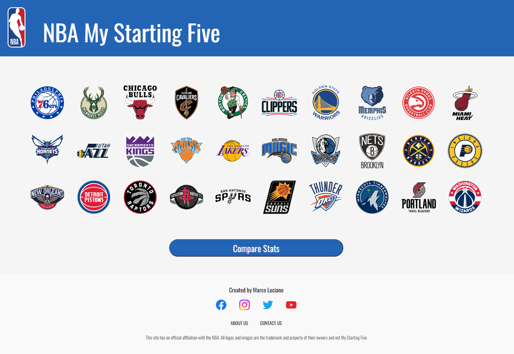

# NBA - My Starting Five

**_NBA - My Starting Five is a fun and interactive application for comparing NBA Player stats with custom-made digital NBA Player cards_**

**_Please note that the only pages that are available are the Toronto Raptors team page, the Boston Celtics team page, and the Compare Stats page_**

This is my capstone project for BrainStation's bootcamp. Students were tasked to create their very own full-stack application within a two week time frame.

NBA - My Starting Five was made using create-react-app, react-router and SASS for the front end.

I used Node/Express to create a backend API with data I retrieved myself.

🏀 Thank you for checking out my application, I hope you had fun! 🏀

- Marco Luciano (April, 2023)

# Installation

You will need to follow these steps to run NBA - My Starting Five (locally)
_*Note: You will need node and npm already installed*_
